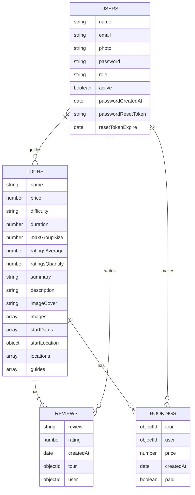
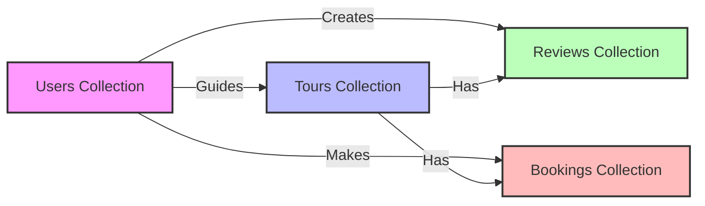
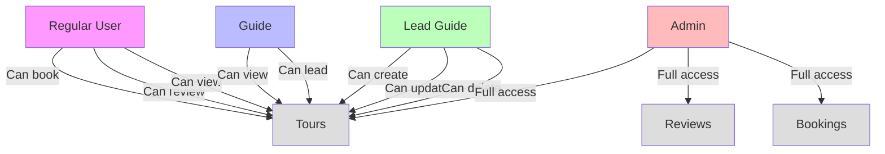

# Tours Application Database Documentation

## Database Collections Overview

This document describes the MongoDB collections and their relationships in the Tours application database.

### Collections Structure

The database consists of four main collections:

1. Users
2. Tours
3. Reviews
4. Bookings

## Users Collection

### Schema Fields

- `name` (String): User's full name (8-21 characters)
- `email` (String): Unique email address
- `photo` (String): Profile photo filename (default: 'default.jpg')
- `password` (String): Hashed password (8-20 characters)
- `role` (String): User role - can be 'user', 'admin', 'guide', or 'lead-guide' (default: 'user')
- `active` (Boolean): Account status (default: true)
- Additional fields for password management and reset functionality

### Security Features

- Passwords are hashed using bcrypt before storage
- Password reset tokens are encrypted using SHA-256
- Inactive users are filtered from queries

## Tours Collection

### Schema Fields

- `name` (String): Unique tour name (4-20 characters)
- `price` (Number): Tour price
- `difficulty` (String): Tour difficulty level ('easy', 'medium', 'difficult')
- `duration` (Number): Tour duration
- `maxGroupSize` (Number): Maximum group size
- `ratingsAverage` (Number): Average rating (1-5, default: 4.5)
- `ratingsQuantity` (Number): Number of ratings (default: 0)
- `summary` (String): Tour summary
- `description` (String): Detailed description
- `imageCover` (String): Cover image filename
- `images` (Array of Strings): Tour images
- `startDates` (Array of Dates): Available tour dates
- `startLocation` (GeoJSON Point): Tour starting location
- `locations` (Array of GeoJSON Points): Tour stops
- `guides` (Array of ObjectIds): References to User documents

### Indexes

- Compound index on `price` and `ratingsAverage`
- Geospatial index on `startLocation`

## Reviews Collection

### Schema Fields

- `review` (String): Review text (8-300 characters)
- `rating` (Number): Rating value (0-5)
- `createdAt` (Date): Review creation date
- `tour` (ObjectId): Reference to Tour document
- `user` (ObjectId): Reference to User document

### Special Features

- Unique compound index on `tour` and `user` to prevent duplicate reviews
- Automatic update of tour ratings when reviews are added/modified

## Bookings Collection

### Schema Fields

- `tour` (ObjectId): Reference to Tour document
- `user` (ObjectId): Reference to User document
- `price` (Number): Price at time of booking
- `createdAt` (Date): Booking creation date
- `paid` (Boolean): Payment status (default: true)

## Relationships

### Tours ⟷ Users (Guides)

- Tours have a many-to-many relationship with Users through the `guides` field
- Guides can be assigned to multiple tours
- Tours can have multiple guides

### Tours ⟷ Reviews

- One-to-many relationship
- A Tour can have multiple Reviews
- Each Review belongs to exactly one Tour
- Reviews automatically update the Tour's rating statistics

### Users ⟷ Reviews

- One-to-many relationship
- A User can write multiple Reviews
- Each Review belongs to exactly one User
- Users can only write one review per tour

### Tours ⟷ Bookings

- One-to-many relationship
- A Tour can have multiple Bookings
- Each Booking belongs to exactly one Tour

### Users ⟷ Bookings

- One-to-many relationship
- A User can have multiple Bookings
- Each Booking belongs to exactly one User

## Population Behavior

- Tour queries automatically populate guide information
- Review queries automatically populate user information
- Booking queries automatically populate both user and tour information

## Virtual Fields

- Tours have a virtual `durationInWeeks` field calculated from the duration
- Tours have a virtual `reviews` field for easier access to related reviews

## Database Schema Diagram

## Collection Relationships Flow

## User Roles and Access Flow

